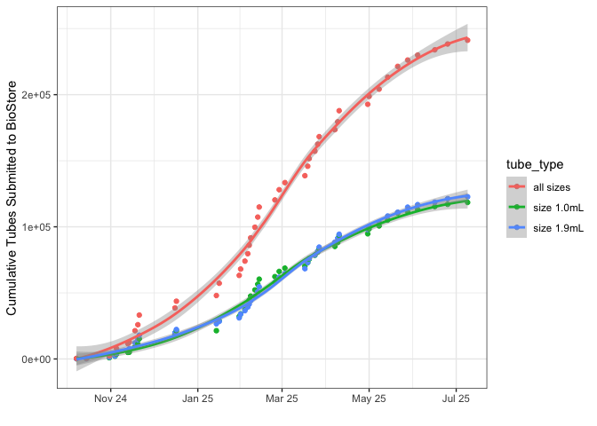
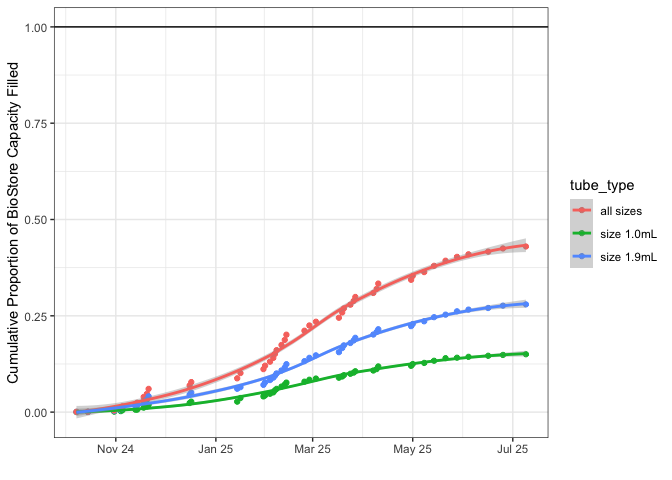
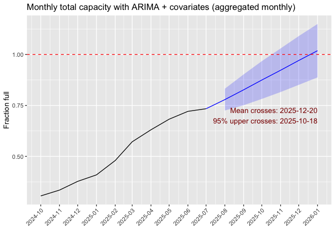

<!-- README.md is generated from README.Rmd. Please edit that file -->

# biostoreCapacity

<!-- badges: start -->

[](https://lifecycle.r-lib.org/articles/stages.html#experimental)
[](https://CRAN.R-project.org/package=biostoreCapacity)
[](https://github.com/mshilts1/biostoreCapacity/actions/workflows/R-CMD-check.yaml)
<!-- badges: end -->

The goal of `biostoreCapacity` is to attempt to predict when VUMC’s
institutional resource [BioStore II
freezer](https://www.vumc.org/oor/index.php/vumc-biospecimen-storage)
will be full and unable to store any additional ECHO biospecimens.

To estimate this, the data in the model should include, at least:

- Historical data of the rate of freezer filling from ECHO.  
- Current and future biospecimen kit builds.
- Expected number of biospecimens to be collected over time.

## Installation

You can install the development version of biostoreCapacity from
[GitHub](https://github.com/) with:

``` r
# install.packages("pak")
pak::pak("mshilts1/biostoreCapacity")
```

Eventually, I’m going to *attempt* to put this on Shiny so it’s easy for
anyone to use, but I will still keep the source code transparent on
GitHub.

## What is the total BioStore II capacity?

The simplest equation for calculating BioStore capacity is:

$$\frac{(196,412 + x)}{788,256} + \frac{(212,692 + y)}{438,840} = 1$$

where:  
\* $196,412$ is the number of ECHO 1.0 ml tubes already stored (or
pending) in the BioStore (as of 2025-09-02).  
\* $x$ is the number of 1.0 ml tubes still to be collected for ECHO.  
\* $212,692$ is the number of ECHO 1.9 ml tubes already stored (or
pending) in the BioStore (as of 2025-09-02).  
\* $y$ is the number of 1.9 ml tubes still to be collected for ECHO.  
\* $788,256$ is the absolute maximum number of 1.0 ml tubes that can be
stored in the BioStore (assuming 0 1.9 ml tubes).  
\* $438,840$ is the absolute maximum number of 1.0 ml tubes that can be
stored in the BioStore (assuming 0 1.9 ml tubes).

Both $x$ and $y$ can increase, but as one increases the capacity for the
other decreases. The total capacity cannot exceed 1, or 100%.

## What should go into the forecast model of when the BioStore will be at capacity?

How can we estimate both $x$ and $y$ above, and when the capacity of the
BioStore will be full?

**This is the data that I think we need to predict when the BioStore
will be full:**

- Historical data (time series data on number of ECHO tubes added to the
  BioStore over time). $\color{green}{\text{✓}}$  
- Expected number of kits that will be collected by kit type over time.
  $\color{red}{\text{✘}}$
  - Expected number of kits over time needs to include ability to handle
    complexities introduced due to “specialized” kits, which are not
    collected by all sites. $\color{yellow}{\text{◎}}$
- Number of tubes in current kit builds per each kit type.
  $\color{green}{\text{✓}}$  
- Proportion of tubes from each kit type expected to be sent back to the
  biorepository. (e.g., may get only a tiny bit of urine from young
  babies, and so may not receive all three 1.9ml tubes for storage).
  $\color{yellow}{\text{◎}}$

Green checkmark ($\color{green}{\text{✓}}$ ) means we have that data, a
yellow dot ($\color{yellow}{\text{◎}}$) means it’s speculative estimated
data that we can kind of guess at, while a red x
($\color{red}{\text{✘}}$ ) means **WE AS THE LAB CORE** are missing that
specific information but it does exist.

Here’s an idea of the kind of formula I’m thinking of, where $FF$ is
“Freezer Filling”:

First, we can attempt to make a model using the historical data of ECHO
submissions to the BioStore:

$$FF_{t+1} = f(FF_{t} + FF_{t-1} + FF_{t-2} + \cdots + error)$$

Second, we know there were changes to the ECHO protocol that will mean
the historical rate of data can’t be relied on alone, as we need to
consider other predictor variables:

$$FF_{pv} = f(enrollment, collection, tubes, loss, error)$$

where:  
$enrollment$ is the expected number of participants from whom specimens
will be collected from.  
$collection$ is the biospecimen collection schedule over time.  
$tubes$ is the number of tubes per each biospecimen collection kit.  
$loss$ is some sort of drop-out rate; participant drop-out, not all
tubes from a kit being returned to the biorepository, etc.

The final model might be something mixing the two above models:

$$FF_{mixed} = f(FF_{t+1},FF_{pv, error})$$

$error$ in all models isn’t mean to indicate error in the colloquial
sense, but to allow for random variation and the effects of variables
not captured in the model.

## Usage

``` r
library(biostoreCapacity)
#> Registered S3 method overwritten by 'quantmod':
#>   method            from
#>   as.zoo.data.frame zoo
```

## Load in data above that we do have

### Historical data

``` r
historical_data <- readHistorical()
historical_data_long <- longifyReadHistorical() # same thing as above, but in "long" format for easier plotting
historical_data_long_proportions <- longifyReadHistorical(total_or_prop = "prop") # same as directly above, but proportions of freezer capacity instead of raw numbers
```

Plot rate of accessioning over time:

``` r
library(ggplot2)
ggplot(historical_data_long, aes(x = date, y = total, colour = tube_type)) +
  geom_point() +
  geom_smooth() +
  theme_bw() +
  ylab("Cumulative Tubes Submitted to BioStore") +
  xlab("") +
  scale_x_date(date_breaks = "2 month", date_labels = "%b %y")
#> `geom_smooth()` using method = 'loess' and formula = 'y ~ x'
```



Plot overall proportion of BioStore filled over time:

``` r
ggplot(longifyReadHistorical(total_or_prop = "prop", add_pending = TRUE), aes(x = date, y = total, colour = tube_type)) +
  geom_point() +
  geom_smooth() +
  theme_bw() +
  ylab("Cumulative Proportion of BioStore Capacity Filled") +
  xlab("") +
  scale_x_date(date_breaks = "2 month", date_labels = "%b %y") + 
  geom_hline(yintercept = 1)
#> `geom_smooth()` using method = 'loess' and formula = 'y ~ x'
```


\## Eric Koplin’s ARIMA model

``` r
single_arima()
#> $mean_cross
#> [1] "2025-12-20"
#> 
#> $upper_cross
#> [1] "2025-10-18"
```



### Future kit builds and biospecimen collection protocol

``` r
biospecimen_collections <- readCollections()
biospecimen_collections
#> # A tibble: 27 × 29
#>    collection_id   kit_type biospecimen_type participant tube_size tubes_per_kit
#>    <chr>           <chr>    <chr>            <chr>       <chr>             <dbl>
#>  1 breastmilk_1.9… breastm… breastmilk       maternal    1.9ml                 8
#>  2 breastmilk_1ml… breastm… breastmilk       maternal    1ml                  10
#>  3 cord_blood_1.9… cord_bl… cord_blood       child       1.9ml                 6
#>  4 cord_blood_1ml… cord_bl… cord_blood       child       1ml                  10
#>  5 placenta_1.9ml… placenta placenta         maternal    1.9ml                16
#>  6 urine_cup_mate… urine_c… urine            maternal    1.9ml                 3
#>  7 urine_cup_mate… urine_c… urine            maternal    1.9ml                 3
#>  8 urine_diaper_1… urine_d… urine            child       1.9ml                 3
#>  9 urine_cup_curr… urine_c… urine            partner     1.9ml                 3
#> 10 urine_cup_mate… urine_c… urine            maternal    1.9ml                 3
#> # ℹ 17 more rows
#> # ℹ 23 more variables: proportion_from_kit_collected <dbl>, visit <chr>,
#> #   visit_logical_order <dbl>, specimen_type <chr>, y_2025 <dbl>, y_2026 <dbl>,
#> #   y_2027 <dbl>, y_2028 <dbl>, y_2029 <dbl>, y_2030 <dbl>,
#> #   y_2025_proportion <dbl>, y_2026_proportion <dbl>, y_2027_proportion <dbl>,
#> #   y_2028_proportion <dbl>, y_2029_proportion <dbl>, y_2030_proportion <dbl>,
#> #   specialized_obesity <chr>, specialized_obesity_proportion <chr>, …
```

There’s currently some information in `readCollections()` that’s
speculative and outright intended to be tunable by an end user.

**Information in `readCollections()` that can be assumed to be true and
constant for the sake of building the model:**

- All columns with information about the kit builds:
  - `collection_id`, `kit_type`, `biospecimen_type`, `participant`,
    `tube_size`, `tubes_per_kit`.  
- All columns about the biospecimen collection timeline:
  - `visit`, `specimen_type`, `y_2025`, `y_2026`, `y_2027`, `y_2028`,
    `y_2029`, `y_2030`, `specialized_obesity`, `specialized_chemphys`,
    `specialized_lifestyle`.

**Speculative columns all contain the word “proportion” in the name:**

    * `proportion_from_kit_collected`, `y_2025_proportion`, `y_2026_proportion`, `y_2027_proportion`, `y_2028_proportion`, `y_2029_proportion`, `y_2030_proportion`, `specialized_obesity_proportion`, `specialized_chemphys_proportion`, `specialized_lifestyle_proportion`.   

A more thorough description of every column in `readCollections()`:

1.  collection_id: a unique ID. a concatenation of kit_type, tube_size,
    visit, and specimen_type.  
2.  kit_type: concatenation of biospecimen_type and participant.  
3.  biospecimen_type: type of biospecimen being collected (e.g., urine
    or blood, etc…).  
4.  participant: specimen to be collected from an ECHO child, child’s
    mother, or child’s mother’s current partner.  
5.  tube_size: whether tube is 1.0mL or 1.9mL (1.9mL tubes take up more
    space in the BioStore.).  
6.  tubes_per_kit: number of tubes of specified size in that specific
    kit.  
7.  proportion_from_kit_collected. what proportion of tubes in that kit
    are we expecting to be returned to be stored in the BioStore? for
    example, newborn babies may not produce enough urine for all three
    1.9mL tubes to be filled and returned. maybe only two will be
    returned.  
8.  visit. time point in child’s or child’s mother’s life when specimen
    is collected.  
9.  visit_logical_order. not really that useful here, but orders the
    visit column by the logical order of an ECHO child’s life (sort of;
    due to preconception protocol, that gets complicated).  
10. specimen_type. is specimen considered by ECHO a core, preconception,
    or specialized specimen? this is important because sites are
    expected to at least try to collect every core specimen, while sites
    are only allowed to collected specific specialized specimens. the
    preconception specimens are somewhere in the middle.  
11. y_2025. 1 (yes)/ 0 (no) column. is this specific specimen to be
    collected in calendar year 2025?  
12. y_2026. same as for y_2025, but calendar year 2026.  
13. y_2027. same as for y_2025, but calendar year 2027.  
14. y_2028. same as for y_2025, but calendar year 2028.  
15. y_2029. same as for y_2025, but calendar year 2029.  
16. y_2030. same as for y_2025, but calendar year 2030.  
17. y_2025_proportion: this is set to 0.25 because there’s only about
    25% of calendar year 2025 left.
18. y_2026_proportion: leave at 1 unless there’s some reason to think
    specimens won’t be collected for all of 2026.  
19. y_2027_proportion: leave at 1 unless there’s some reason to think
    specimens won’t be collected for all of 2027.  
20. y_2028_proportion: leave at 1 unless there’s some reason to think
    specimens won’t be collected for all of 2028.  
21. y_2029_proportion: leave at 1 unless there’s some reason to think
    specimens won’t be collected for all of 2029.  
22. y_2030_proportion: leave at 1 unless there’s some reason to think
    specimens won’t be collected for all of 2030.  
23. specialized_obesity: is that biospecimen being collected by sites
    where the PI selected “obesity” as an outcome of interest?  
24. specialized_obesity_proportion. proportion of sites  
25. specialized_chemphys.  
26. specialized_chemphys_proportion.  
27. specialized_lifestyle.  
28. specialized_lifestyle_proportion.  
29. notes.
