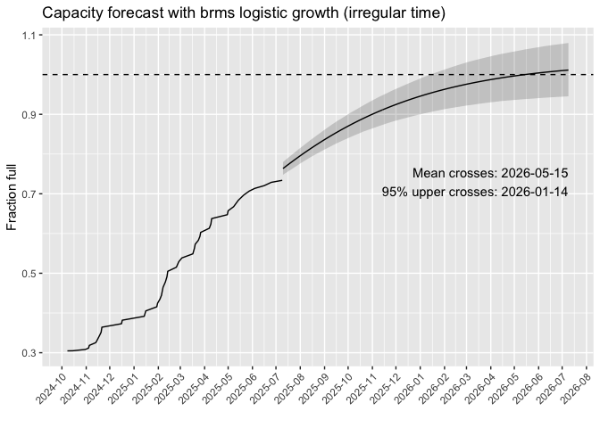

<!-- README.md is generated from README.Rmd. Please edit that file -->

# biostoreCapacity

<!-- badges: start -->

[](https://lifecycle.r-lib.org/articles/stages.html#experimental)
[](https://CRAN.R-project.org/package=biostoreCapacity)
[](https://github.com/mshilts1/biostoreCapacity/actions/workflows/R-CMD-check.yaml)
<!-- badges: end -->

The goal of `biostoreCapacity` is to attempt to predict when VUMC’s
institutional resource [BioStore II
freezer](https://www.vumc.org/oor/index.php/vumc-biospecimen-storage)
will be full and unable to store any additional ECHO biospecimens.

To estimate this, the data in the model should try to include:

- Historical data of the rate of freezer filling from ECHO. ✅  
- Current and future biospecimen kit builds. ✅  
- Expected number of biospecimens to be collected over time. ❌

✅ means we have that data.  
❌ means **WE AS THE LAB CORE** are missing (some of) that specific
information, but it does exist!

## What is the total BioStore II capacity?

The simplest equation for calculating BioStore capacity is:

$$\frac{(a + x)}{788,256} + \frac{(b + y)}{438,840} = 1$$

where:

| Component | Description |
|---:|----|
| $a$ | number of ECHO 1.0 ml tubes already collected (~200K as of September 2025) |
| $x$ | number of 1.0 ml tubes still to be collected for ECHO |
| $b$ | number of ECHO 1.9 ml tubes already collected (~210K as of September 2025) |
| $y$ | number of 1.9 ml tubes still to be collected for ECHO |
| 788,256 | maximum number of 1.0 ml tubes that can be stored in the BioStore, if no 1.9 ml tubes |
| 438,840 | maximum number of 1.9 ml tubes that can be stored in the BioStore, if no 1.0 ml tubes |

Both $x$ and $y$ will continue to increase, but as one increases, the
capacity for the other decreases. The total capacity cannot exceed 1, or
100%.

## What should go into the forecast model of when the BioStore will be at capacity?

How can we estimate both $x$ and $y$ above, and when the capacity of the
BioStore will be full?

**This is the data that I think we need to predict when the BioStore
will be full:**

- Historical data (time series data on number of ECHO tubes added to the
  BioStore over time). ✅  
- Expected number of kits that will be collected by kit type over time.
  ❌
  - Expected number of kits over time needs to include ability to handle
    complexities introduced due to “specialized” kits, which are not
    collected by all sites. 🟡  
- Number of tubes in current kit builds per each kit type. ✅  
- Proportion of tubes from each kit type expected to be sent back to the
  biorepository. (e.g., may get only a tiny bit of urine from young
  babies, and so may not receive all three 1.9ml tubes for storage). 🟡

### General proposed model structure

Here’s an idea of the kind of formula I’m thinking of, where $FF$ is
“Freezer Filling”:

First, we can attempt to make a model using the historical data of ECHO
submissions to the BioStore:

$$FF_{t+1} = f(FF_{t} + FF_{t-1} + FF_{t-2} + \cdots + error)$$

Second, we know there were changes to the ECHO protocol that will mean
the historical rate of data can’t be relied on alone, as we need to
consider other predictor variables:

$$FF_{pv} = f(enrollment, collection, tubes, loss, error)$$

where:  
$enrollment$ is the expected number of participants from whom specimens
will be collected from. WE DO NOT HAVE THIS DATA.  
$collection$ is the biospecimen collection schedule over time.  
$tubes$ is the number of tubes per each biospecimen collection kit.  
$loss$ is some sort of drop-out rate; participant drop-out, not all
tubes from a kit being returned to the biorepository, etc.

The final model would be something mixing the two above models:

$$FF_{mixed} = f(FF_{t+1},FF_{pv, error})$$

$error$ in all models isn’t mean to indicate error in the colloquial
sense, but to allow for random variation and the effects of variables
not captured in the model.

## Usage

You can install the development version of biostoreCapacity from
[GitHub](https://github.com/) with:

``` r
# install.packages("pak")
pak::pak("mshilts1/biostoreCapacity")
```

Eventually, I’m going to *attempt* to put this on Shiny so it’s easy for
anyone to use, but I will still keep the source code transparent on
GitHub.

``` r
library(biostoreCapacity)
#> Registered S3 method overwritten by 'quantmod':
#>   method            from
#>   as.zoo.data.frame zoo
```

## Plot Historical Data

#### Plot rate of accessioning over time:

This includes “pending” tubes, which are tubes that are still at the
sites but will be shipped here eventually and should be counted towards
the BioStore’s total inventory.

    #> `geom_smooth()` using method = 'loess' and formula = 'y ~ x'


### Eric Koplin’s ARIMA model

Eric Koplin has built an ARIMA model using the forecast package to
predict when the BioStore would be full based on the historical rate of
filling:

``` r
single_arima()
```


### Eric Koplin’s BRMS model (Fit Bayesian Generalized (Non-)Linear Multivariate Multilevel Models)

Eric Koplin has built an ARIMA model using the forecast package to
predict when the BioStore would be full based on the historical rate of
filling:

``` r
single_brms_growth()
#> Compiling Stan program...
#> Trying to compile a simple C file
#> Running /Library/Frameworks/R.framework/Resources/bin/R CMD SHLIB foo.c
#> using C compiler: ‘Apple clang version 17.0.0 (clang-1700.3.19.1)’
#> using SDK: ‘’
#> clang -arch arm64 -std=gnu2x -I"/Library/Frameworks/R.framework/Resources/include" -DNDEBUG   -I"/Library/Frameworks/R.framework/Versions/4.5-arm64/Resources/library/Rcpp/include/"  -I"/Library/Frameworks/R.framework/Versions/4.5-arm64/Resources/library/RcppEigen/include/"  -I"/Library/Frameworks/R.framework/Versions/4.5-arm64/Resources/library/RcppEigen/include/unsupported"  -I"/Library/Frameworks/R.framework/Versions/4.5-arm64/Resources/library/BH/include" -I"/Library/Frameworks/R.framework/Versions/4.5-arm64/Resources/library/StanHeaders/include/src/"  -I"/Library/Frameworks/R.framework/Versions/4.5-arm64/Resources/library/StanHeaders/include/"  -I"/Library/Frameworks/R.framework/Versions/4.5-arm64/Resources/library/RcppParallel/include/"  -I"/Library/Frameworks/R.framework/Versions/4.5-arm64/Resources/library/rstan/include" -DEIGEN_NO_DEBUG  -DBOOST_DISABLE_ASSERTS  -DBOOST_PENDING_INTEGER_LOG2_HPP  -DSTAN_THREADS  -DUSE_STANC3 -DSTRICT_R_HEADERS  -DBOOST_PHOENIX_NO_VARIADIC_EXPRESSION  -D_HAS_AUTO_PTR_ETC=0  -include '/Library/Frameworks/R.framework/Versions/4.5-arm64/Resources/library/StanHeaders/include/stan/math/prim/fun/Eigen.hpp'  -D_REENTRANT -DRCPP_PARALLEL_USE_TBB=1   -I/opt/R/arm64/include    -fPIC  -falign-functions=64 -Wall -g -O2  -c foo.c -o foo.o
#> In file included from <built-in>:1:
#> In file included from /Library/Frameworks/R.framework/Versions/4.5-arm64/Resources/library/StanHeaders/include/stan/math/prim/fun/Eigen.hpp:22:
#> In file included from /Library/Frameworks/R.framework/Versions/4.5-arm64/Resources/library/RcppEigen/include/Eigen/Dense:1:
#> In file included from /Library/Frameworks/R.framework/Versions/4.5-arm64/Resources/library/RcppEigen/include/Eigen/Core:19:
#> /Library/Frameworks/R.framework/Versions/4.5-arm64/Resources/library/RcppEigen/include/Eigen/src/Core/util/Macros.h:679:10: fatal error: 'cmath' file not found
#>   679 | #include <cmath>
#>       |          ^~~~~~~
#> 1 error generated.
#> make: *** [foo.o] Error 1
#> Start sampling
#> Warning: There were 90 divergent transitions after warmup. See
#> https://mc-stan.org/misc/warnings.html#divergent-transitions-after-warmup
#> to find out why this is a problem and how to eliminate them.
#> Warning: Examine the pairs() plot to diagnose sampling problems
#> Warning: Bulk Effective Samples Size (ESS) is too low, indicating posterior means and medians may be unreliable.
#> Running the chains for more iterations may help. See
#> https://mc-stan.org/misc/warnings.html#bulk-ess
#> Warning: Tail Effective Samples Size (ESS) is too low, indicating posterior variances and tail quantiles may be unreliable.
#> Running the chains for more iterations may help. See
#> https://mc-stan.org/misc/warnings.html#tail-ess
#> Compiling Stan program...
#> Trying to compile a simple C file
#> Running /Library/Frameworks/R.framework/Resources/bin/R CMD SHLIB foo.c
#> using C compiler: ‘Apple clang version 17.0.0 (clang-1700.3.19.1)’
#> using SDK: ‘’
#> clang -arch arm64 -std=gnu2x -I"/Library/Frameworks/R.framework/Resources/include" -DNDEBUG   -I"/Library/Frameworks/R.framework/Versions/4.5-arm64/Resources/library/Rcpp/include/"  -I"/Library/Frameworks/R.framework/Versions/4.5-arm64/Resources/library/RcppEigen/include/"  -I"/Library/Frameworks/R.framework/Versions/4.5-arm64/Resources/library/RcppEigen/include/unsupported"  -I"/Library/Frameworks/R.framework/Versions/4.5-arm64/Resources/library/BH/include" -I"/Library/Frameworks/R.framework/Versions/4.5-arm64/Resources/library/StanHeaders/include/src/"  -I"/Library/Frameworks/R.framework/Versions/4.5-arm64/Resources/library/StanHeaders/include/"  -I"/Library/Frameworks/R.framework/Versions/4.5-arm64/Resources/library/RcppParallel/include/"  -I"/Library/Frameworks/R.framework/Versions/4.5-arm64/Resources/library/rstan/include" -DEIGEN_NO_DEBUG  -DBOOST_DISABLE_ASSERTS  -DBOOST_PENDING_INTEGER_LOG2_HPP  -DSTAN_THREADS  -DUSE_STANC3 -DSTRICT_R_HEADERS  -DBOOST_PHOENIX_NO_VARIADIC_EXPRESSION  -D_HAS_AUTO_PTR_ETC=0  -include '/Library/Frameworks/R.framework/Versions/4.5-arm64/Resources/library/StanHeaders/include/stan/math/prim/fun/Eigen.hpp'  -D_REENTRANT -DRCPP_PARALLEL_USE_TBB=1   -I/opt/R/arm64/include    -fPIC  -falign-functions=64 -Wall -g -O2  -c foo.c -o foo.o
#> In file included from <built-in>:1:
#> In file included from /Library/Frameworks/R.framework/Versions/4.5-arm64/Resources/library/StanHeaders/include/stan/math/prim/fun/Eigen.hpp:22:
#> In file included from /Library/Frameworks/R.framework/Versions/4.5-arm64/Resources/library/RcppEigen/include/Eigen/Dense:1:
#> In file included from /Library/Frameworks/R.framework/Versions/4.5-arm64/Resources/library/RcppEigen/include/Eigen/Core:19:
#> /Library/Frameworks/R.framework/Versions/4.5-arm64/Resources/library/RcppEigen/include/Eigen/src/Core/util/Macros.h:679:10: fatal error: 'cmath' file not found
#>   679 | #include <cmath>
#>       |          ^~~~~~~
#> 1 error generated.
#> make: *** [foo.o] Error 1
#> Start sampling
#> Warning: There were 1 divergent transitions after warmup. See
#> https://mc-stan.org/misc/warnings.html#divergent-transitions-after-warmup
#> to find out why this is a problem and how to eliminate them.
#> Warning: Examine the pairs() plot to diagnose sampling problems
#> Compiling Stan program...
#> Trying to compile a simple C file
#> Running /Library/Frameworks/R.framework/Resources/bin/R CMD SHLIB foo.c
#> using C compiler: ‘Apple clang version 17.0.0 (clang-1700.3.19.1)’
#> using SDK: ‘’
#> clang -arch arm64 -std=gnu2x -I"/Library/Frameworks/R.framework/Resources/include" -DNDEBUG   -I"/Library/Frameworks/R.framework/Versions/4.5-arm64/Resources/library/Rcpp/include/"  -I"/Library/Frameworks/R.framework/Versions/4.5-arm64/Resources/library/RcppEigen/include/"  -I"/Library/Frameworks/R.framework/Versions/4.5-arm64/Resources/library/RcppEigen/include/unsupported"  -I"/Library/Frameworks/R.framework/Versions/4.5-arm64/Resources/library/BH/include" -I"/Library/Frameworks/R.framework/Versions/4.5-arm64/Resources/library/StanHeaders/include/src/"  -I"/Library/Frameworks/R.framework/Versions/4.5-arm64/Resources/library/StanHeaders/include/"  -I"/Library/Frameworks/R.framework/Versions/4.5-arm64/Resources/library/RcppParallel/include/"  -I"/Library/Frameworks/R.framework/Versions/4.5-arm64/Resources/library/rstan/include" -DEIGEN_NO_DEBUG  -DBOOST_DISABLE_ASSERTS  -DBOOST_PENDING_INTEGER_LOG2_HPP  -DSTAN_THREADS  -DUSE_STANC3 -DSTRICT_R_HEADERS  -DBOOST_PHOENIX_NO_VARIADIC_EXPRESSION  -D_HAS_AUTO_PTR_ETC=0  -include '/Library/Frameworks/R.framework/Versions/4.5-arm64/Resources/library/StanHeaders/include/stan/math/prim/fun/Eigen.hpp'  -D_REENTRANT -DRCPP_PARALLEL_USE_TBB=1   -I/opt/R/arm64/include    -fPIC  -falign-functions=64 -Wall -g -O2  -c foo.c -o foo.o
#> In file included from <built-in>:1:
#> In file included from /Library/Frameworks/R.framework/Versions/4.5-arm64/Resources/library/StanHeaders/include/stan/math/prim/fun/Eigen.hpp:22:
#> In file included from /Library/Frameworks/R.framework/Versions/4.5-arm64/Resources/library/RcppEigen/include/Eigen/Dense:1:
#> In file included from /Library/Frameworks/R.framework/Versions/4.5-arm64/Resources/library/RcppEigen/include/Eigen/Core:19:
#> /Library/Frameworks/R.framework/Versions/4.5-arm64/Resources/library/RcppEigen/include/Eigen/src/Core/util/Macros.h:679:10: fatal error: 'cmath' file not found
#>   679 | #include <cmath>
#>       |          ^~~~~~~
#> 1 error generated.
#> make: *** [foo.o] Error 1
#> Start sampling
#> $fit_total
#>  Family: gaussian 
#>   Links: mu = identity 
#> Formula: total_capacity ~ Asym/(1 + exp((xmid - t)/scal)) 
#>          Asym ~ 1
#>          xmid ~ 1 + prop_1ml + total_submitted_capacity
#>          scal ~ 1
#>    Data: hist_init (Number of observations: 45) 
#>   Draws: 2 chains, each with iter = 2000; warmup = 1000; thin = 1;
#>          total post-warmup draws = 2000
#> 
#> Regression Coefficients:
#>                               Estimate Est.Error l-95% CI u-95% CI Rhat
#> Asym_Intercept                    1.03      0.04     0.96     1.12 1.00
#> xmid_Intercept                    0.11      0.17    -0.20     0.44 1.00
#> xmid_prop_1ml                    -0.06      0.16    -0.37     0.25 1.00
#> xmid_total_submitted_capacity     0.11      0.99    -1.82     1.99 1.00
#> scal_Intercept                    1.76      0.09     1.60     1.94 1.00
#>                               Bulk_ESS Tail_ESS
#> Asym_Intercept                     525      792
#> xmid_Intercept                     551      883
#> xmid_prop_1ml                      918      893
#> xmid_total_submitted_capacity     1435     1344
#> scal_Intercept                     566      940
#> 
#> Further Distributional Parameters:
#>       Estimate Est.Error l-95% CI u-95% CI Rhat Bulk_ESS Tail_ESS
#> sigma     0.02      0.00     0.02     0.03 1.00     1201     1157
#> 
#> Draws were sampled using sampling(NUTS). For each parameter, Bulk_ESS
#> and Tail_ESS are effective sample size measures, and Rhat is the potential
#> scale reduction factor on split chains (at convergence, Rhat = 1).
#> 
#> $fit_prop
#> Warning: There were 90 divergent transitions after warmup. Increasing
#> adapt_delta above 0.8 may help. See
#> http://mc-stan.org/misc/warnings.html#divergent-transitions-after-warmup
#>  Family: gaussian 
#>   Links: mu = identity 
#> Formula: prop_1ml ~ s(t, k = 10) 
#>    Data: hist_init (Number of observations: 45) 
#>   Draws: 2 chains, each with iter = 2000; warmup = 1000; thin = 1;
#>          total post-warmup draws = 2000
#> 
#> Smoothing Spline Hyperparameters:
#>           Estimate Est.Error l-95% CI u-95% CI Rhat Bulk_ESS Tail_ESS
#> sds(st_1)     0.21      0.18     0.01     0.64 1.01      145      231
#> 
#> Regression Coefficients:
#>           Estimate Est.Error l-95% CI u-95% CI Rhat Bulk_ESS Tail_ESS
#> Intercept     0.48      0.03     0.43     0.53 1.00      343      212
#> st_1         -0.20      0.43    -1.17     0.55 1.01       75       52
#> 
#> Further Distributional Parameters:
#>       Estimate Est.Error l-95% CI u-95% CI Rhat Bulk_ESS Tail_ESS
#> sigma     0.18      0.02     0.14     0.22 1.00      609      991
#> 
#> Draws were sampled using sampling(NUTS). For each parameter, Bulk_ESS
#> and Tail_ESS are effective sample size measures, and Rhat is the potential
#> scale reduction factor on split chains (at convergence, Rhat = 1).
#> 
#> $fit_sub
#> Warning: There were 1 divergent transitions after warmup. Increasing
#> adapt_delta above 0.8 may help. See
#> http://mc-stan.org/misc/warnings.html#divergent-transitions-after-warmup
#>  Family: gaussian 
#>   Links: mu = identity 
#> Formula: total_submitted_capacity ~ s(t, k = 10) 
#>    Data: hist_init (Number of observations: 45) 
#>   Draws: 2 chains, each with iter = 2000; warmup = 1000; thin = 1;
#>          total post-warmup draws = 2000
#> 
#> Smoothing Spline Hyperparameters:
#>           Estimate Est.Error l-95% CI u-95% CI Rhat Bulk_ESS Tail_ESS
#> sds(st_1)     0.01      0.01     0.00     0.03 1.00      607      924
#> 
#> Regression Coefficients:
#>           Estimate Est.Error l-95% CI u-95% CI Rhat Bulk_ESS Tail_ESS
#> Intercept     0.01      0.00     0.01     0.01 1.00     2093     1213
#> st_1          0.01      0.02    -0.02     0.05 1.00     1015      939
#> 
#> Further Distributional Parameters:
#>       Estimate Est.Error l-95% CI u-95% CI Rhat Bulk_ESS Tail_ESS
#> sigma     0.00      0.00     0.00     0.00 1.00     1783     1389
#> 
#> Draws were sampled using sampling(NUTS). For each parameter, Bulk_ESS
#> and Tail_ESS are effective sample size measures, and Rhat is the potential
#> scale reduction factor on split chains (at convergence, Rhat = 1).
#> 
#> $forecast
#> # A tibble: 365 × 4
#>    date        mean lower upper
#>    <date>     <dbl> <dbl> <dbl>
#>  1 2025-07-10 0.764 0.748 0.780
#>  2 2025-07-11 0.765 0.749 0.782
#>  3 2025-07-12 0.767 0.750 0.783
#>  4 2025-07-13 0.768 0.752 0.785
#>  5 2025-07-14 0.770 0.753 0.787
#>  6 2025-07-15 0.771 0.754 0.788
#>  7 2025-07-16 0.773 0.756 0.790
#>  8 2025-07-17 0.774 0.757 0.791
#>  9 2025-07-18 0.776 0.758 0.793
#> 10 2025-07-19 0.777 0.759 0.795
#> # ℹ 355 more rows
#> 
#> $mean_cross_date
#> [1] "2026-05-15"
#> 
#> $upper_cross_date
#> [1] "2026-01-14"
#> 
#> $plot
```



### Site collection information for model priors and adjustments

I’ve created a function which will get the data from elvislims from
Bio-Track with all site collections, and information from REDCap about
which specialized collections each site’s PI signed up for.

Both sets of data can only be accessed by someone with the correct
credentials on both sites, and so are not publicly available here or
anywhere else.

The data gets merged, processed, cleaned, and all potentially
identifiable data is removed. Site ID is replaced by a randomized ID, so
we can get SOME idea about enrollment numbers by site, but the actual
site ID can’t be pulled from this data. (Yes, someone who is already
extremely knowledgable about the operations of ECHO Cycle 2 could
probably figure out sites from the data, but that type of person would
already have access to the full data.)

``` r
site_collections()
#> # A tibble: 204,017 × 16
#>    site_id_randomized               number_of_containers container_type capacity
#>    <chr>                                           <int> <chr>             <int>
#>  1 2f65c9a05b770edb650f839c06514908                  119 [FH prefixed]…       48
#>  2 2f65c9a05b770edb650f839c06514908                  119 [FH prefixed]…       48
#>  3 2f65c9a05b770edb650f839c06514908                  119 [FH prefixed]…       48
#>  4 2f65c9a05b770edb650f839c06514908                  119 [FH prefixed]…       48
#>  5 2f65c9a05b770edb650f839c06514908                  119 [FH prefixed]…       48
#>  6 2f65c9a05b770edb650f839c06514908                  119 [FH prefixed]…       48
#>  7 2f65c9a05b770edb650f839c06514908                  119 [FH prefixed]…       48
#>  8 2f65c9a05b770edb650f839c06514908                  119 [FH prefixed]…       48
#>  9 2f65c9a05b770edb650f839c06514908                  119 [FH prefixed]…       48
#> 10 2f65c9a05b770edb650f839c06514908                  119 [FH prefixed]…       48
#> # ℹ 204,007 more rows
#> # ℹ 12 more variables: number_of_specimen <int>, specimen_type <chr>,
#> #   sample_type <chr>, storage_date <chr>, nominal_volume <chr>,
#> #   partial_aliquot <lgl>, partial_volume <dbl>, tube_size <chr>,
#> #   specialized_whole_blood <int>, specialized_breast_milk <int>,
#> #   specialized_urine <int>, shipped <int>
```

## Future kit builds and biospecimen collection protocol

We can’t really use this information yet, because we do not have a clear
estimate of the number of participants.

``` r
biospecimen_collections <- readCollections()
biospecimen_collections
#> # A tibble: 27 × 29
#>    collection_id   kit_type biospecimen_type participant tube_size tubes_per_kit
#>    <chr>           <chr>    <chr>            <chr>       <chr>             <dbl>
#>  1 breastmilk_1.9… breastm… breastmilk       maternal    1.9ml                 8
#>  2 breastmilk_1ml… breastm… breastmilk       maternal    1ml                  10
#>  3 cord_blood_1.9… cord_bl… cord_blood       child       1.9ml                 6
#>  4 cord_blood_1ml… cord_bl… cord_blood       child       1ml                  10
#>  5 placenta_1.9ml… placenta placenta         maternal    1.9ml                16
#>  6 urine_cup_mate… urine_c… urine            maternal    1.9ml                 3
#>  7 urine_cup_mate… urine_c… urine            maternal    1.9ml                 3
#>  8 urine_diaper_1… urine_d… urine            child       1.9ml                 3
#>  9 urine_cup_curr… urine_c… urine            partner     1.9ml                 3
#> 10 urine_cup_mate… urine_c… urine            maternal    1.9ml                 3
#> # ℹ 17 more rows
#> # ℹ 23 more variables: proportion_from_kit_collected <dbl>, visit <chr>,
#> #   visit_logical_order <dbl>, specimen_type <chr>, y_2025 <dbl>, y_2026 <dbl>,
#> #   y_2027 <dbl>, y_2028 <dbl>, y_2029 <dbl>, y_2030 <dbl>,
#> #   y_2025_proportion <dbl>, y_2026_proportion <dbl>, y_2027_proportion <dbl>,
#> #   y_2028_proportion <dbl>, y_2029_proportion <dbl>, y_2030_proportion <dbl>,
#> #   specialized_obesity <chr>, specialized_obesity_proportion <chr>, …
```

**Information in `readCollections()` that can be assumed to be “true”
for the sake of building the model:**

- All columns with information about the kit builds:
  - `collection_id`, `kit_type`, `biospecimen_type`, `participant`,
    `tube_size`, `tubes_per_kit`.  
- All columns about the biospecimen collection timeline:
  - `visit`, `specimen_type`, `y_2025`, `y_2026`, `y_2027`, `y_2028`,
    `y_2029`, `y_2030`, `specialized_obesity`, `specialized_chemphys`,
    `specialized_lifestyle`.

**Speculative columns all contain the word “proportion” in the name:**

    * `proportion_from_kit_collected`, `y_2025_proportion`, `y_2026_proportion`, `y_2027_proportion`, `y_2028_proportion`, `y_2029_proportion`, `y_2030_proportion`, `specialized_obesity_proportion`, `specialized_chemphys_proportion`, `specialized_lifestyle_proportion`.   

------------------------------------------------------------------------

# Only read below if you want more details!

A more thorough description of every column in `readCollections()`:

| Variable | Description |
|---:|----|
| collection_id | a unique ID. a concatenation of kit_type, tube_size, visit, and specimen_type |
| kit_type | concatenation of biospecimen_type and participant |
| biospecimen_type | type of biospecimen being collected (e.g., urine or blood, etc…) |
| participant | specimen to be collected from an ECHO child, child’s mother, or child’s mother’s current partner |
| tube_size | whether tube is 1.0mL or 1.9mL (1.9mL tubes take up more space in the BioStore.) |
| tubes_per_kit | number of tubes of specified size in that specific kit |
| proportion_from_kit_collected | what proportion of tubes in that kit are we expecting to be returned to be stored in the BioStore? for example, newborn babies may not produce enough urine for all three 1.9mL tubes to be filled and returned. maybe only two will be returned |
| visit | time point in child’s or child’s mother’s life when specimen is collected |
| visit_logical_order | not really that useful here, but orders the visit column by the logical order of an ECHO child’s life (sort of; due to preconception protocol, that gets complicated) |
| specimen_type | is specimen considered by ECHO a core, preconception, or specialized specimen? this is important because sites are expected to at least try to collect every core specimen, while sites are only allowed to collected specific specialized specimens. the preconception specimens are somewhere in the middle |
| y_2025 | 1 (yes)/ 0 (no) column. is this specific specimen to be collected in calendar year 2025? |
| y_2026 | same as for y_2025, but calendar year 2026 |
| y_2027 | same as for y_2025, but calendar year 2027 |
| y_2028 | same as for y_2025, but calendar year 2028 |
| y_2029 | same as for y_2025, but calendar year 2029 |
| y_2030 | same as for y_2025, but calendar year 2030 |
| y_2025_proportion | this is set to 0.25 because there’s only about 25% of calendar year 2025 left |
| y_2026_proportion | leave at 1 unless there’s some reason to think specimens won’t be collected for all of 2026 |
| y_2027_proportion | leave at 1 unless there’s some reason to think specimens won’t be collected for all of 2027 |
| y_2028_proportion | leave at 1 unless there’s some reason to think specimens won’t be collected for all of 2028 |
| y_2029_proportion | leave at 1 unless there’s some reason to think specimens won’t be collected for all of 2029 |
| y_2030_proportion | leave at 1 unless there’s some reason to think specimens won’t be collected for all of 2030 |
| specialized_obesity | is that biospecimen being collected by sites where the PI selected obesity as an outcome of interest? |
| specialized_obesity_proportion | proportion of participants from sites where PI selected obesity as outcome of interest. |
| specialized_chemphys | is that biospecimen being collected by sites where the PI selected Chemical/Phyical as an exposure of interest? |
| specialized_chemphys_proportion | proportion of participants from sites where PI selected Chemical/Physical as exposure of interest |
| specialized_lifestyle | is that biospecimen being collected by sites where the PI selected Lifestyle as an exposure of interest? |
| specialized_lifestyle_proportion | proportion of participants from sites where PI selected Lifestyle as exposure of interest |
| notes | general notes about the data for your reference |

Green checkmark (✅ ) means we have that data, a yellow dot (🟡) means
it’s speculative estimated data that we can kind of guess at, while a
red x (❌ ) means **WE AS THE LAB CORE** are missing that specific
information but it does exist.
